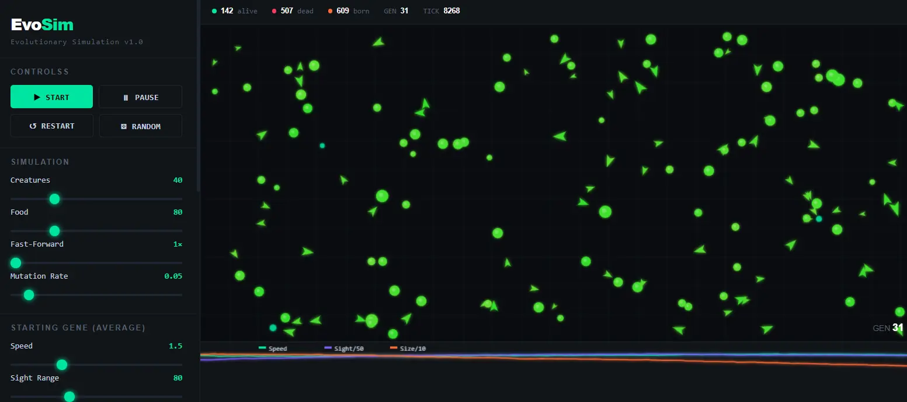

# EvoSim

A 2D evolution simulation running entirely in the browser. Watch natural selection, genetics, and adaptation unfold in real time on an HTML5 Canvas.

[Live Demo](https://nicohartmann.dev/evosim_en.html)



## What is EvoSim?

EvoSim visualizes the core principles of evolutionary biology in an interactive, living ecosystem. Every creature carries an individual genetic makeup, competes for energy, seeks mates, and passes on its traits, or fails to survive long enough to do so. No scripted outcomes, no predetermined paths. Just emergence.

## Features

- **Individual Genetics:** Each creature is defined by three genes: speed, vision range, and size. They come with coloration directly reflecting their genotype at a glance.
- **Dynamic Energy System:** A continuously shifting energy balance drives selection pressure, rewarding well-adapted individuals and eliminating those that cannot keep up.
- **Reproduction & Mutation:** Creatures actively seek mates, combining genes via crossover. A configurable mutation rate allows entirely new traits to emerge across generations.
- **Live Event System:** Trigger environmental stressors at any time: droughts, plagues, mutation waves, or predator invasions. This is to stress-test the ecosystem and observe how populations adapt.
- **Genetic Trend Graph:** An integrated live graph tracks how key traits shift across generations, making macro-level evolutionary trends visible in real time.
- **Event Log & Hover Tooltips:** Dive deeper into population data with a running event log and interactive tooltips on individual creatures.
- **Zero Dependencies:** A pure vanilla JavaScript implementation, complex autonomous agent logic and data visualization with no external libraries.

## Tech Stack

- **HTML5 Canvas:** For all real-time creature rendering and simulation visualization.
- **CSS3:** For sidebar layout, controls, and graph styling.
- **JavaScript (Vanilla):** For the full simulation engine: agent behavior, genetics, energy dynamics, event handling, and live charting, entirely dependency-free.

## Getting Started

To run this project locally, follow these steps:

1. **Clone the Repository**

```bash
git clone https://github.com/kt-NicoHartmann/EvoSim.git
```

2. **Open the Project**

Navigate into the project directory and open the HTML file in your preferred web browser.

```bash
cd EvoSim/evosim_en/
# On macOS/Linux:
open evosim_en.html
# On Windows:
start evosim_en.html
```

Alternatively, use an extension like Live Server in VS Code to host it locally.

## Credits & Licenses

This project includes third-party open-source software and assets bundled within the repository:

- [Space Mono](https://fonts.google.com/specimen/Space+Mono) – SIL Open Font License (OFL)
- [Syne](https://fonts.google.com/specimen/Syne) – SIL Open Font License (OFL)
